# Games-Engine-Assignment

Name: Robert Hatfield

Student Number: C18475892

Class Group: TU857

# Decription of the Project
The goal of this project is to create a proceduarally generated system in Unity. This project has two scenes one being a menu which displays a name for the game and two buttons one to start the game and the other to end it, the other scene is a procedurally generated terrain which is a green terrain that has flowers appear randomly infront of the controlled player. As the terrain is procedurally generated it will be different each time the game is played and the terrain offset is changed to make it appear as though the player is moving forward. As the game goes further and you gain more points less flowers begin to appear and the flowers completely stop spawning after a while, this aspect is more a point towards the real life situation in which more and more land is developed and slowly kills of the bees who need that land to survive. 

Link to YouTube video,
https://youtu.be/n4Sp3sTEOlM

If the above does not work: https://www.youtube.com/watch?v=n4Sp3sTEOlM 

If both links do not work the video will be in the repository.

# Instructions for use
To run this Unity project you must first run the project in the Unity Editor which will display the main menu where you can click the PLAY button to play the game. The game will then change the scene to the actual game scene where you will be behind the bee/player and from there you can use the left and right arrow keys to move the bee from side to side to collect the oncoming flowers. The primary aim of the game is just to collect as many flowers which will take longer further into the game as they spawn less frequently the higher score you have and once you reach the score of 65 the game comes to an end where it will display that there are no more flowers for the bee to collect which leaves it wandering with no more flowers to gather.

# How it works
In this section I will go through each section of the game and explain how each works.
The first section to explain is the main menu which is the first thing to see when running the game. Once that is done I will go through how the terrain, bee, audio, flowers and score are handled. Scripts and assets for each section will also be explained for each section to show what they include and how they work.

The Main Menu has two options which are placed below the title "PLAY" and "EXIT". The Main Menu UI is created using a canvas and then adding a panel object to the canvas which will allow for a background to be added. An empty object is then added to the canvas so that the buttons can be grouped up for a cleaner look and so that a single script can be added to the object to control both buttons.

Below is the code for the Main Menu to allow for the buttons to work as intended.

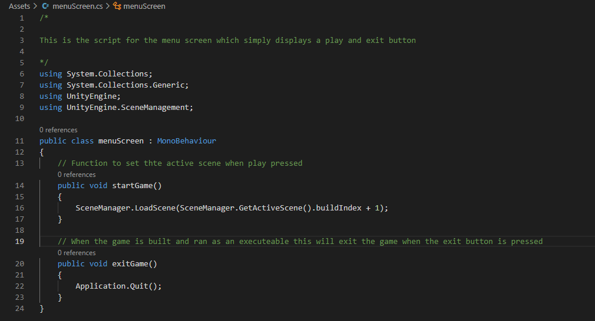

The next image shows the Main Menu as it is in the unity editor with use of TextMeshPro, honeycomb image, bee image and a material called sunshine gradient to give it the appearance of a colour gradient.

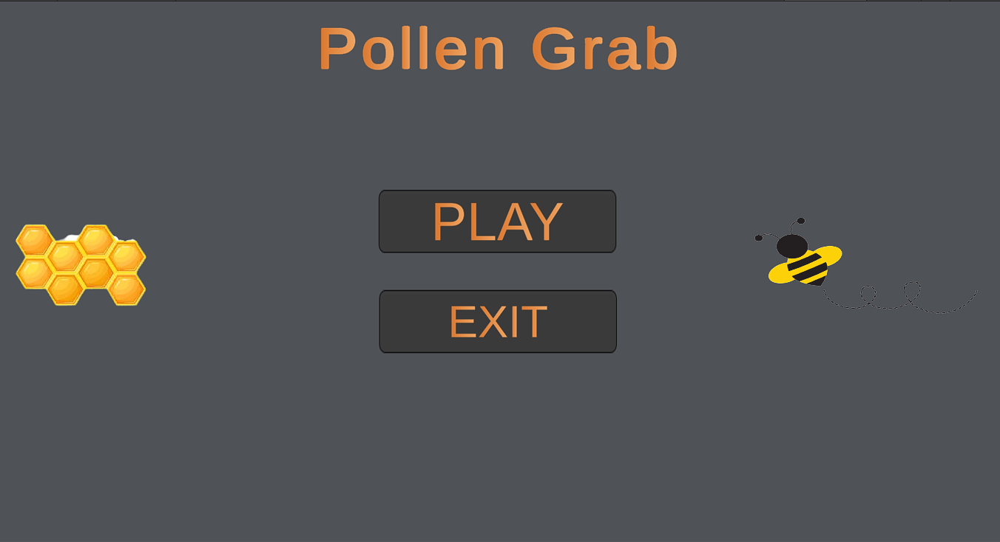

The next scene is the main game in which the first part to go over is the terrain itself and how it is generated. The terrain uses one script to generate procedurally which is based of the same script done in the module with a modification which makes it so that the terrain has its offest changed to make it appear as though the player is moving forward however th player is stationary. The script used to generate the terrain is also based of perlin nosie. Below is a snippet of the code where the offset is changed.

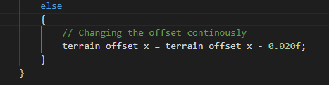

Below is a screenshot of the terrain after it has been generated.

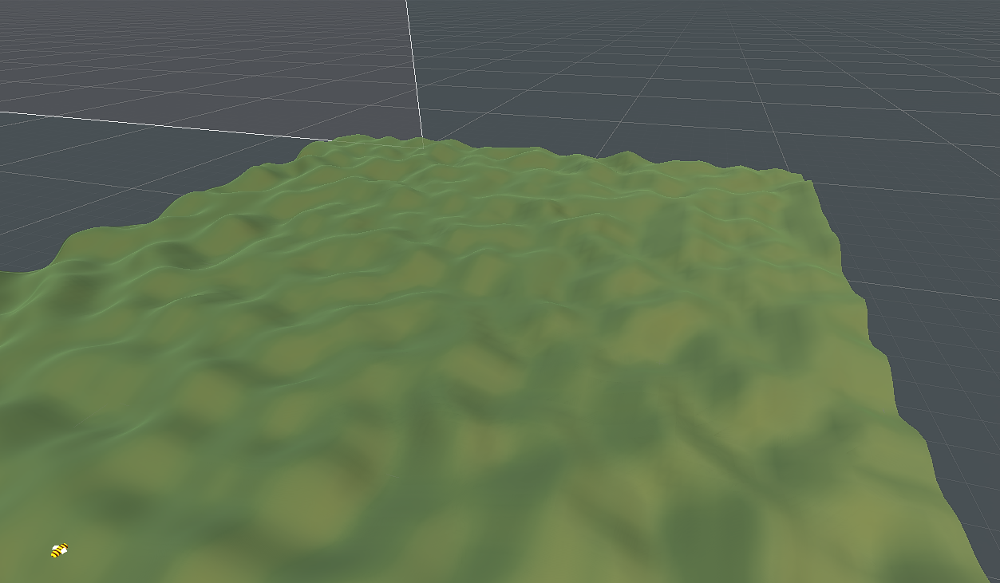

Lastly for the terrain the startGameScript.cs is a script attached to the terrain to begin playing the game song which is the song My love(piano loop) seen here https://freesound.org/people/ShadyDave/sounds/325611/. Below is a screenshot of teh above mentioned c# file.

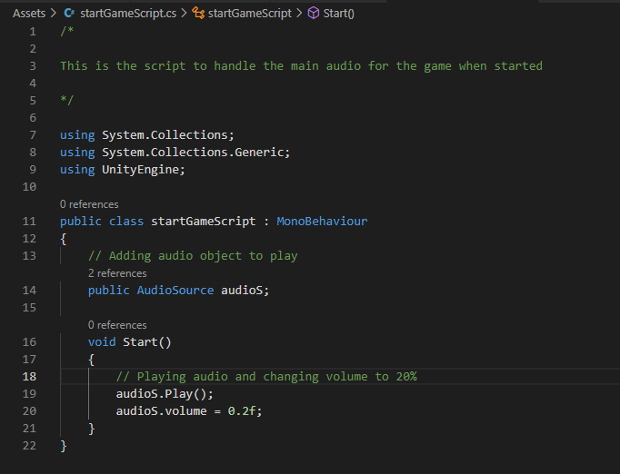

Next to disscus is the bee which is the player and is made up of a capsule, two cubes and two spheres with a box collider surrounding it instead of a mesh renderer to save a small amount of processing power. The bee is also covered in a material created from a sprite photo which acts as a shader to mimic the colours of a bee. Below is a screenshot of the materials including the material used for the bee body which is called bStripes and a screenshot of the makeup of the bee object.

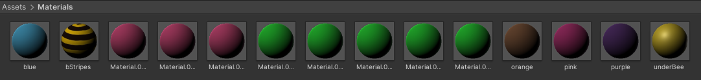

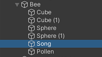

Besides the materials the bee is controlled by a single script which is called beeMove. This script allows for the bee to move side to side within a certain range using the left and right arrow keys which are preset in most versions in unity. The bee also handles the collision with the flowers as well as the score added after each collision. Below are two images firstly of the code for the bee movement and the second for the collision.

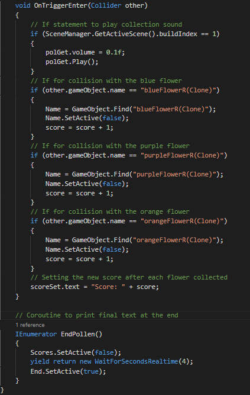

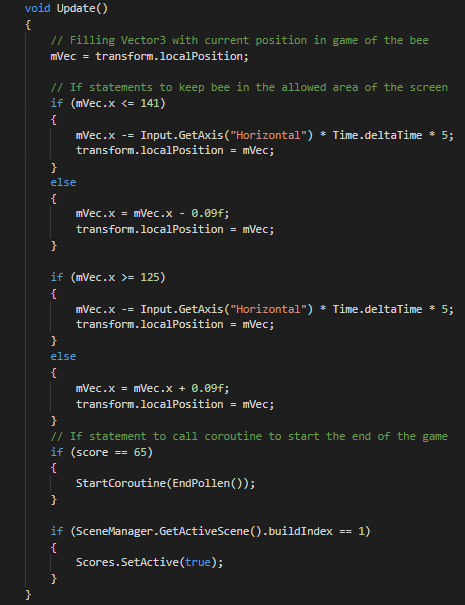

As the bee collides with each flower it plays the audio polGet which is an edited sound created from the artist cameronmusic seen here https://freesound.org/people/cameronmusic/sounds/138410/ which is a website hosting many free sound samples. The collider also sets each flower object to be disabled which is then enabled again in the flower generation scripts and this is done to ensure that there is only ever three flower objects at a time one of each colour. This stops an infinte amount of them spawning to reduce load and below is a screenshot of the flowers created in blender with the original flower acting as a host to create random colour duplicates.

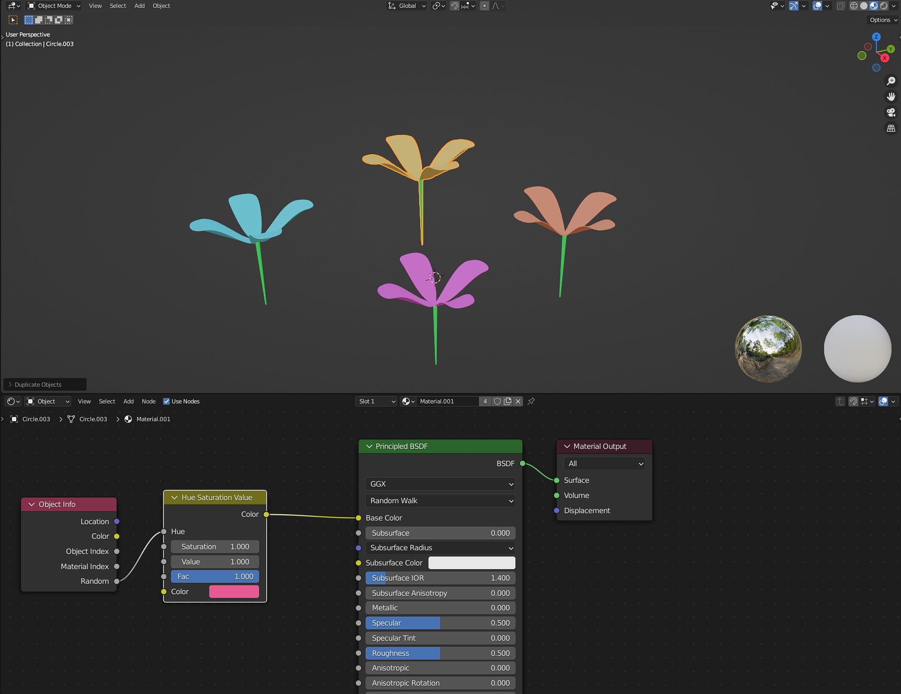

Lastly the bee handles the score gotten from each flower and changes the score display in the top left of the screen.

This is done by having both the score object which is a text object and its text area mapped to the variables Scores and scoreSet in the beeMove.cs script. Lastly for the bee here is some screenshots of the front and back of the bee.

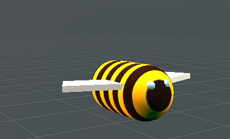

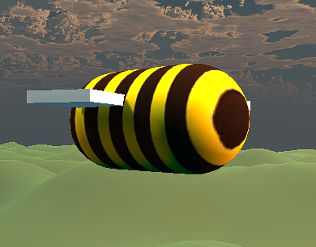

Lastly after the bee covering both audio and score are the flowers used in the game. All three flowers have their own respective scripts which handle their positioning and spawn rate. The blue flower has the blueFlowGen.cs script, the orange flower has the oranFlowGen.cs script and the purple flower has the purpFloweGen.cs script. Below is the basic layout of the first blue flower generation script.

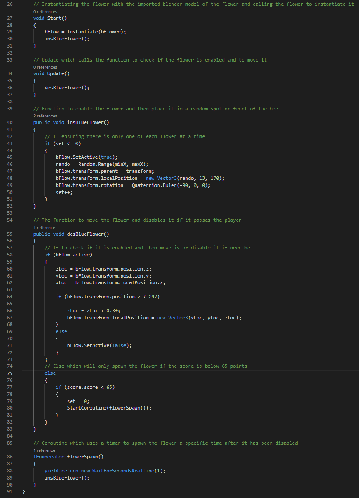

This script contains two function called insBlueFlower and desBlueFlower, the first sets the object as enabled and then chooses a random number on the x axis within range of the player to spawn at and increments the set variable to ensure that there is only one flower of a type at a time. The next function desBlueFlower handles the movement of the flower to move towards the player in as close to the offset of the terrain as possible, it does this until the flower passes the player and then disables the flower object which causes the if statement to call upon the coroutine flowerSpawn. It only calls the coroutine as long as it is below its point threshold which for the blue flower is 65, the orange flower is 35 and the purple flower is 15. Similar to the point threshold each flower has a wait timer in the coroutine before they are placed in the game once again, the blue flower waits 1 second, the orange flower waits 2 seconds and the purple flower waits 3 seconds. Lastly for the flower each flower has a mesh collider as they have a more complicated design and at the cost of a heavier load the mesh collider adds a more defined area for the player to hit as a box colider made it too easy to hit the flower. Below is a screenshot of the mesh collider on one of the flowers.

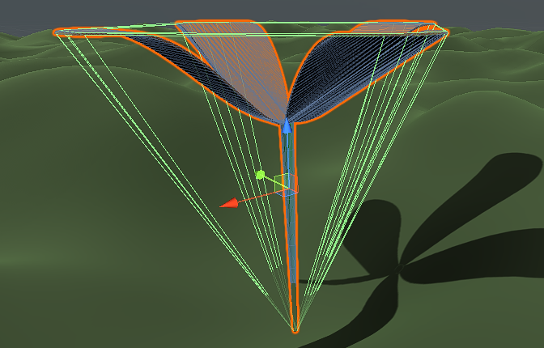

To note the skybox was imported from the asset store and the images on the Main Menu were also taken from sources online.

# List of Classes/Assets in the Project and whether they were made yourself or modified or if they are from a Source, with References.
| Scripts and Assets | Source |
| ------------- | ------------- |
| MenuScreen.cs | Brackeys tutorial |
| TerrainGen.cs | Followed program from lecture and modified it |
| beeMove.cs | Self written |
| startGameScript.cs | Self Written |
| blueFlowGen.cs | Self written |
| oranFlowGen.cs | Self written |
| purpFlowGen.cs | Self written |
| bee-trail-no BG | Acquired online |
| BG | Self made |
| blueFlower | Self made |
| blueFlowerR | Self made |
| bee-seamless | Acquired online |
| eye | Self made |
| honeycomb-no BG | Acquired online |
| My-love-piano Loop.wav | Acquired online |
| New Terrain | Unity constructed |
| orangeFlower | Self made |
| orangeFlowerR | Self made |
| Pollen-get | Acquired online |
| purpleFlower | Self made |
| purpleFlowerR | Self made |
| Skybox | Downloaded asset |
| sunshineGradient | Self made |
| terrainShader | Self made |
| bStripes | Self made |
| All flower materials | Self made |

# References

https://assetstore.unity.com/ - asset store

https://www.youtube.com/watch?v=zc8ac_qUXQY - Menu

https://assetstore.unity.com/packages/2d/textures-materials/sky/skybox-series-free-103633 - skybox

https://freesound.org/people/ShadyDave/sounds/325611/ - Audios

https://github.com/skooter500/GE1-2021-2022 - Terrain Generation

https://www.shutterstock.com/search/bee+stripe+pattern - Bee strip sprite

https://www.clipartkey.com/view/hJTRhw_bee-with-trail-clipart/ - bee with trail

https://www.shutterstock.com/search/honeycomb+cartoon - Honeycomb

# What I am most proud of in the Assignment
For this project I am quite happy with the handling of resources through the reuse of objects for th flowers which is highly important especially for computers that lack the hardware to run heavy load programs. The other aspect I am quite proud of is the models of the flowers I had created which were done in Blender. I had no prior knowledge of Blender and it gave me an opportunity to start from scratch and learn for myself how to use the application. 

# Changes I would make

If I am to continue this project instead of a moving terrain I would like to create an area where the player will have full range to move in a 3D enviroment where there are other animals they have to compete with.

#Previous proposal:

Name: Robert Hatfield

Student Number: C18475892

Class Group: TU857

For teh assignment I want to create a procedurally generated landscape in which the player will be placed to then collect objects that will be coming towards it. The objects or player will be a 3D model created in Blender that will have a more complex design.

The player will be able to move to come into contact with the objects and collect them for points as they spawn using coroutines.
